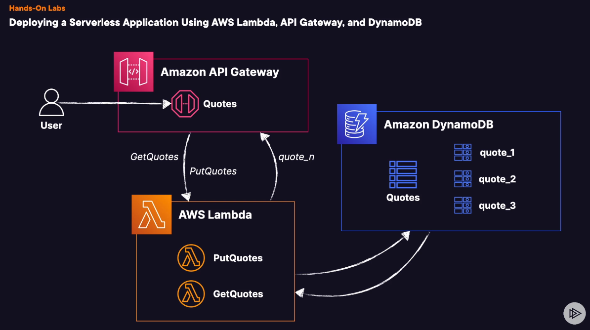

# Deploying a Serverless Application Using AWS Lambda, API Gateway, and DynamoDB

## Introduction

In this hands-on lab, you will learn how to create and deploy a fully serverless application utilizing some of AWS's most powerful services. By the end of this lab, you will have a serverless application architecture in place, featuring Amazon API Gateway, AWS Lambda, and Amazon DynamoDB.

## Getting Started

### Prerequisites

- Log in to the AWS Management Console using the credentials provided on the lab instructions page.
- Ensure you are operating in the `us-east-1` Region.
- Navigate to IAM > Roles and confirm the existence of an IAM role named `OurApiGatewayToCloudWatchLogsRole`. Copy its ARN for later use. It should resemble: `arn:aws:iam::111111111111:role/OurApiGatewayToCloudWatchLogsRole`.
    - If this role does not exist, locate the CloudWatch Logs Policy JSON document in the provided GitHub repository and create it.

## Lab Steps

## Step 1: Creating the DynamoDB Table

1. Navigate to the DynamoDB console.
2. Find and select the Tables menu on the left-hand side.
3. Click Create table.
4. Under Table details, for Table name, enter Quotes.
5. For Partition Key enter quote and make it a String type.
6. For Sort key enter author and make it a String type.
7. Under Table settings, select Customize settings.
8. For Table class, choose DynamoDB Standard.
9. Move down to Read/write capacity settings.
10. For Capacity mode choose Provisioned.
11. Set the Read capacity Auto scaling to On.
12. Set the Minimum capacity units to 1, the Maximum capacity units to 5, and Target utilization (%) to 20.
13. Set the Write capacity Auto scaling to On.
14. Set the Minimum capacity units to 1, the Maximum capacity units to 5, and Target utilization (%) to 20.
15. Move to the Encryption at rest settings.
16. Choose AWS managed key.
17. Skip to the bottom and select Create table.
18. Wait for the table to be created before moving on!

## Step 2: Create Lambda Functions

Now let's create the backend functions that will be used to generate and receive quotes!

### PutQuotes Function

1. Navigate to the Lambda console.
2. Click on **Functions** on the left-hand menu.
3. Find and select **Create function**.
4. Choose **Author from scratch**.
5. For the **Function name** enter `PutQuotes`.
6. For the **Runtime** select `Python 3.12`.
7. Ensure the **Architecture** is set to `x86_64`.
8. Under **Permissions**, expand the dropdown menu for **Change default execution role**.
9. Within the dropdown menu, under **Execution role**, select **Create a new role from AWS policy templates**.
10. For the **Role name**, enter `PutQuotesRole`.
11. Under the **Policy templates - optional** dropdown, find and select **Simple microservice permissions**.
12. Scroll to the bottom and select **Create function**.
13. Once your function is created, find and select the function **Configuration** tab on the screen (Should be in the middle of the window).
14. Within the configuration menu, under **General Configuration**, choose **Edit**.
15. Change the **Timeout** to 1 min 0 sec, and then click **Save**.
16. Back within the configuration screen, find and select **Environment variables**.
17. Click on **Edit**.
18. Choose **Add environment variable**.
19. For **Key** enter `TABLE_NAME`, and for **Value** enter `Quotes` (the DynamoDB table name).
20. Click **Save**.
21. Navigate back to the **Code** tab for the function.
22. Copy and paste the Python code for `PutQuotes` supplied via the GitHub repo: [`PutQuotes Lambda Function Code`](https://github.com/pluralsight-cloud/aws-certified-solutions-architect-associate/raw/main/bootcamp-hands-on-labs/03-week-3/3.1%20-%20Deploying%20a%20Serverless%20Application%20Using%20AWS%20Lambda,%20API%20Gateway,%20and%20DynamoDB/put_quote_lambda_function.py).
23. Select **Deploy**.

**Note** Take some time to digest what the code does!

### GetQuotes Function

1. Navigate back to the **Functions** menu within the Lambda console.
2. Find and select **Create function**.
3. Choose **Author from scratch**.
4. For the **Function name** enter `GetQuotes`.
5. For the **Runtime** select `Python 3.12`.
6. Ensure the **Architecture** is set to `x86_64`.
7. Under **Permissions**, expand the dropdown menu for **Change default execution role**.
8. Within the dropdown menu, under **Execution role**, select **Create a new role from AWS policy templates**.
9. For the **Role name**, enter `GetQuotesRole`.
10. Under the **Policy templates - optional** dropdown, find and select **Simple microservice permissions**.
11. Scroll to the bottom and select **Create function**.
12. Once your function is created, find and select the function **Configuration** tab on the screen (Should be in the middle of the window).
13. Within the configuration menu, under **General Configuration**, choose **Edit**.
14. Change the **Timeout** to 1 min 0 sec, and then click **Save**.
15. Back within the configuration screen, find and select **Environment variables**.
16. Click on **Edit**.
17. Choose **Add environment variable**.
18. For **Key** enter `TABLE_NAME`, and for **Value** enter `Quotes` (the DynamoDB table name).
19. Click **Save**.
20. Navigate back to the **Code** tab for the function.
21. Copy and paste the Python code for `GetQuotes` supplied via the GitHub repo: [`GetQuotes Lambda Function Code`](https://github.com/pluralsight-cloud/aws-certified-solutions-architect-associate/raw/main/bootcamp-hands-on-labs/03-week-3/3.1%20-%20Deploying%20a%20Serverless%20Application%20Using%20AWS%20Lambda,%20API%20Gateway,%20and%20DynamoDB/get_quote_lambda_function.py).
22. Select **Deploy**.

**Note** Take some time to digest what the code does!

Move on to creating our Amazon API Gateway REST API!

## 3. Create Regional REST API

### What is REST?

REST, or Representational State Transfer, is an architectural style for designing networked applications. It uses a stateless, client-server, cacheable communications protocol, almost always HTTP.

##### Main Features of REST

1. **Stateless**: Each request from a client to the server must contain all the information needed to understand and complete the request. The server does not store any state about the client session on the server side.

2. **Client-Server**: This separation of concerns supports the independence of different types of applications and improves scalability by simplifying the server components.

3. **Uniform Interface**: To achieve the uniformity, REST uses standardized HTTP methods (GET, POST, PUT, DELETE, etc.), resource-based URLs, media types for data representation, and stateless communication.

4. **Layered System**: REST allows for a layered system architecture where a client cannot ordinarily tell whether it is connected directly to the end server, or to an intermediary along the way. This enables the use of intermediary servers to improve system scalability and performance.

5. **Cacheable**: Responses must define themselves as cacheable or not to prevent clients from reusing stale or inappropriate data, thus improving the efficiency and user experience.

6. **Code on Demand (optional)**: Servers can extend the functionality of a client by transferring executable code. This is an optional feature of REST.

RESTful APIs, like the one created with Amazon API Gateway and AWS Lambda in the provided excerpt, adhere to these principles, enabling developers to build scalable, flexible, and efficient web services.

Navigate to the Amazon API Gateway console.

- On the landing screen, find and select **Build** under the **REST API** option.
- Under **API details**, choose **New API**.
- Set your **API name** to `Quotes`.
- (Optional) Provide a description if you want.
- Set the **API endpoint type** to **Regional**.

Now we can move on to creating our resources and methods!

### Create the PutQuotes Resource

Typically, you would leverage different methods for a singular resource, but for this lab, we are going to use two separate resources for simplicity of demonstrating how these pieces work together.

- Within your newly created REST API, find and select **Resources** on the left-hand menu.
- Click on **Create resource**.
- Leave the **Resource path** at `/`, and then set the **Resource name** to `PutQuotes`.
- Click **Create resource**.
- Ensure you have selected your newly created resource, and then click on **Create method**.
- Under **Method details**, for the **Method type**, select **ANY**.
- For **Integration type** select **Lambda function**.
- Ensure the **Lambda proxy integration** is disabled for this method.
- For the **Lambda function** dropdown, choose `us-east-1` and then select the `PutQuotes` function from the dropdown.
- Leave **Default timeout** enabled.
- Click on **Create method**.

### Create the GetQuotes Resource

Typically, you would leverage different methods for a singular resource, but for this demonstration, we are going to use two separate resources for clarity.

- Within your newly created REST API, find and select **Resources** on the left-hand menu.
- Click on **Create resource**.
- Set the **Resource path** to `/`, and then set the **Resource name** to `GetQuotes`.
- Click **Create resource**.
- Ensure you have selected your newly created resource, and then click on **Create method**.
- Under **Method details**, for the **Method type**, select **ANY**.
- For **Integration type** select **Lambda function**.
- Make sure that the **Lambda proxy integration** option is enabled for the method.
- For the **Lambda function** dropdown, choose `us-east-1` and then select the `GetQuotes` function from the dropdown.
- Leave **Default timeout** enabled.
- Click on **Create method**.

## 4. Deploy, Log, and Test

Now we can test it all out!

1. Within the Amazon API Gateway console, find and select your newly created `Quotes` REST API.
2. Find and click on **Deploy API**.
3. Within the popup menu, for **Deploy API**, select **New Stage** for **Stage**.
4. Give your stage a name (Example: `development`).
5. (Optional) Provide a description if you want.
6. Click **Deploy**.
7. You should now be brought to your newly deployed stage.
8. Within left-hand menu of the API Gateway console, find and select **Settings**.
9. Under **Logging**, select **Edit**.
10. For **CloudWatch log role**, enter the IAM role ARN that was created for you. (If you didn't find and copy this earlier, navigate to IAM, under Roles, find the `OurApiGatewayToCloudWatchLogsRole`, and copy the ARN)
11. Click **Save changes**.
12. Navigate back to your `Quotes` REST API.
13. Select **Stages** from the left-hand menu.
14. Find the **Logs and Tracing** section, then select **Edit**.
15. Under **Logs and tracing settings**, for **CloudWatch logs**, select **Full requests and response logs** from the dropdown menu.
16. Enable **X-Ray tracing**.
17. Click **Save changes**.
18. Now you will be logging responses and requests, as well as collecting X-Ray metrics for each call.
19. Find and copy the **Invoke URL** provided.
20. Install either Thunder Client (a VS Code extension) or Postman to test the API. Use the copied URL to send requests.
21. You should get an error message. This is due to us not providing any resources.
22. Now, at the end of the URL, enter `/PutQuotes` and hit Enter.
23. You will receive a message saying **Item successfully written to DynamoDB** if working correctly.
24. Refresh several times to put more quotes into the table.
25. You can verify that the function is working as intended by exploring the DynamoDB table items.
26. Now, replace the `/PutQuotes` resource with `/GetQuotes` in the Invoke URL and hit enter.
27. You should receive a simple message with a quote! Refresh to randomly select quotes from the database.

Our serverless API is working!

## 5. Extra Challenge (Optional)

### Logging
Explore the logs within CloudWatch for your API Gateway REST API. Look for a log group specific to the API stage you deployed.

### X-Ray
Utilize AWS X-Ray to examine the execution times for each segment of your API call.

## Conclusion
Congratulations — you've successfully completed this hands-on lab!