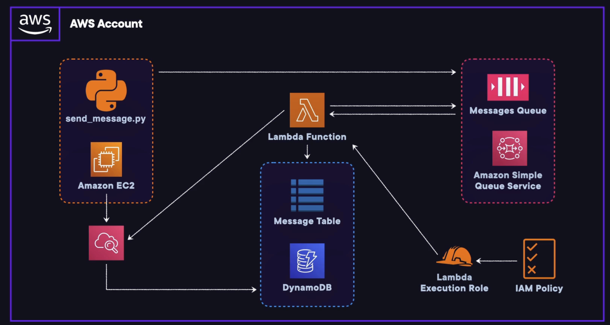

# Triggering AWS Lambda from Amazon SQS

## Introduction

In this hands-on AWS lab, you will learn how to trigger a Lambda function using SQS. This Lambda function will process messages from the SQS queue and insert the message data as records into a DynamoDB table.

## Solution
Log in to the AWS Management Console using the credentials provided on the lab instructions page. Make sure you're using the us-east-1 (N. Virginia) region.

### Create the Lambda Function
1. In the search bar on top, enter `lambda`.
2. From the search results, select `Lambda`.
3. Click the `Create function` button.
4. On the `Create function` page, select `Author from scratch`.
5. Under `Basic Information`, set the following parameters for each field:
    - Function name: Enter `SQSDynamoDB`.
    - Runtime: Select `Python 3.12` from the dropdown menu.
    - Architecture: Select `x86_64`.
6. Under `Permissions`, expand `Change default execution role`.
7. Select `Use an existing role`.
8. Under `Existing role`, select one you have created before from the dropdown menu.
9. Click the `Create function` button.

### Create the SQS Trigger
1. Click the `+ Add trigger` button.
2. Under `Trigger configuration`, click the `Select a source` dropdown menu.
3. From the menu, select `SQS`.
4. Under `SQS queue`, click the search bar and select `Messages`.
5. Ensure that the checkbox next to `Activate trigger` is checked.
6. Click `Add`.

### Copy the Source Code into the Lambda Function
1. Under the `+ Add trigger` button, click the `Code` tab.
2. On the left side, double-click on `lambda_function.py`.
3. Delete the contents of the function.
4. Navigate to the link below to the source code for `lambda_function.py`: [Source Code](https://raw.githubusercontent.com/ACloudGuru-Resources/SQSLambdaTriggers/master/lambda_function.py)
5. Copy the code.
6. Return to the AWS console and paste the code into the `lambda_function.py` code box.
7. Click the `Deploy` button.

### Log In to the EC2 Instance and Test the Script Locally
1. Open Visual Studio Code on your PC.
2. Download the `send_message.py` script from [here](https://raw.githubusercontent.com/ACloudGuru-Resources/SQSLambdaTriggers/master/send_message.py) and save it in your local project directory.
3. Open the `send_message.py` script in Visual Studio Code.
4. In the terminal within Visual Studio Code, navigate to the directory where you saved the `send_message.py` script.
5. Run the script to start sending messages to your DynamoDB table from your Messages SQS queue with an interval of 0.1 seconds: `python send_message.py -q Messages -i 0.1`
6. After a few seconds, hit `Control + C` in the terminal to stop the command from continuing to run.

### Confirm Messages Were Inserted into the DynamoDB Table
1. Return to the browser tab or window with the Messages queue in Amazon SQS open. You may have to wait a few minutes to see results showing up in the tables, but you should soon see a spike in the table `Number of Messages Received`.
2. In the search bar on top, enter `dynamodb`.
3. From the search results, select `DynamoDB`.
4. In the left-hand navigation menu, select `Tables`.
5. Select the `Message` table.
6. In the top-right corner of the page, click `Explore table items` and review the list of items that were inserted from our script, sent to SQS, triggered Lambda, and inserted into the DynamoDB database.

## Conclusion
Congratulations — you've completed this hands-on lab!